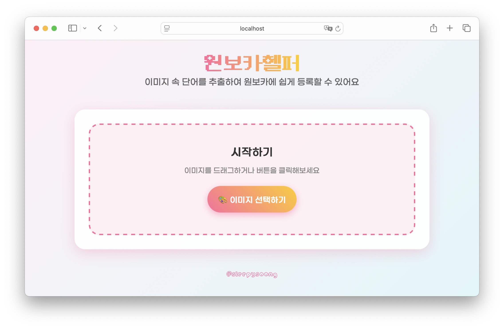
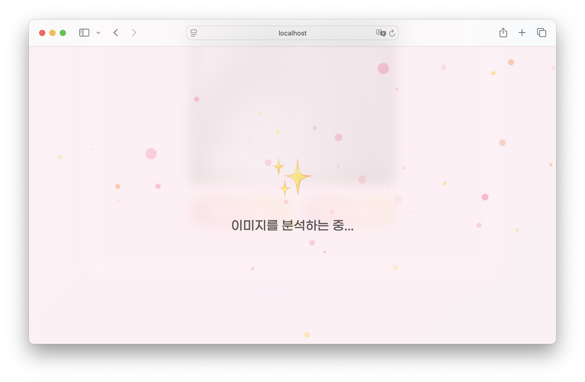
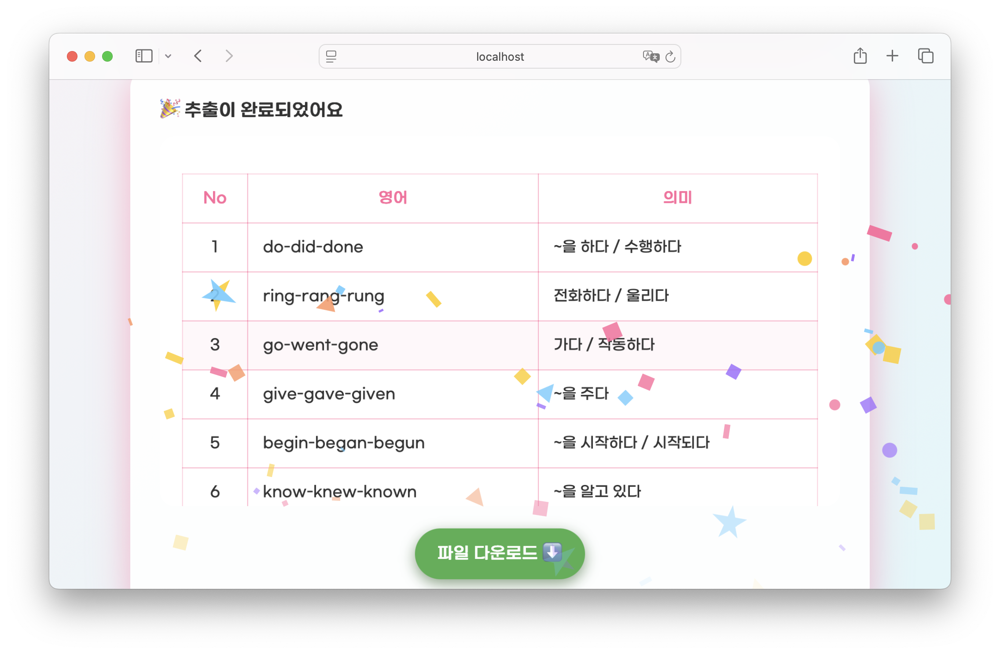

# 원보카헬퍼 (OneVocaHelper)

원보카에 단어장을 쉽게 등록할 수 있도록 이미지에서 단어와 뜻을 추출하여 csv 파일을 만듭니다.
`gemini-2.0-flash-thinking-exp-01-21` 모델을 사용합니다.


## ⚙️ 설치 방법

1. 저장소 클론
```bash
git clone https://github.com/sleepysoong/onevocahelper.git
cd onevocahelper
```

2. 필요한 패키지 설치
```bash
pip install -r requirements.txt
```

3. 환경 변수 설정
`.env` 파일을 생성하고 `Gemini` API 키를 설정합니다:
```
API_KEY=your_gemini_api_key_here
```

4. 코드 실행
```bash
python app.py
```

서버가 실행되면 브라우저에서 `http://localhost:40123`으로 접속할 수 있습니다.


## 📸 스크린샷



